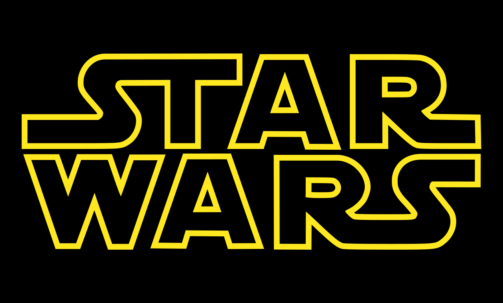

<!--
# Style lead only for this slide
_class: lead
_footer: Algorithmique Avancée et Bibliothèque Graphique - 2022-2023
-->

**ING1** Projet d'informatique

# ECE World!

---

# Equipe X

- Tristan
- Arthur 
- Benjamin
- Felix

---

## Thème

---

# Carte `1/2`

*Réalisée par : **Tristan**, **Felix**.*

**Design:**
- creation d'une map sur mesure (Felix)
  - ajout des sprites (Tristan)

**Fonctions:**
- choix des personnages et des pseudos
- creation d'un ficher .txt pour les collisons de la map
- dialogues et interactions avec les sprites

**Difficultés:**
- Clavier complet fonctionel pour la saisi
- Collision de la map
- avoir une maniere simple et naturel pour lancer les jeux

---

# Carte `2/2`

**Description**
- les musiciens : Osu
- Jarjar Binks : Peche au canard
- Chewbacca et MF : Tir au Ballons
- Stormtrooper : Snake
- Jabba the Hut : Paris hippique
- Yoda et les Jawas : le Jackpot

---

# Organisation des jeux
En utlilisant Github:***1 Jeux = 1 Branche = 1 Fichier***
- les jeux ont leurs propres sous fichers 
  - chaque jeux a sa propre file d'evenements 
- utlilisation d'une file commune pour lancer les jeux 

**fibre commune**
- le menu:
  - file d'evenement principale
- structure jouer
  - conservation des statisiques 
  - mise a jour automatique
---

# Pêche aux canards `1/2`

*Réalisé par : **Felix** (100%)*

- Les canards vont de la droite à la gauche.
- le nombre max de canard est 5.
- Les canards vont à une vitesse différente.
- La collision entre les canards et la cane.

---

# Pêche aux canards `2/2`

**Structures**

- base du jeux:

- image struct duck
- image duck
---

# OSU `1/2`

*Réalisé par : **Benjamin** (100%)*
But du jeux:
- clicker sur les cercles des qu'ils appaissement au rythme de la musique
- le jouer avec le meilleur score gagne
  
---

# OSU `2/2`

**Stockage des donnes:**
- enregistrements des coordonnes et du temps des cercles
  - mis dans des tableu de structure
- les ajouts et retraits de cercles demande un autre tableau de structure
  
- 
**Fonctions principales:**
- gestion du temp et de l'etat de la souris
  - voir si il y a collision entre cercle et click
- gestion des scores et affichages
---

# Snake `1/2`
*Réalisé par : **Tristan** (100%)*

- Structure 'Body'
  - les coordonees
  - la direction
  - une liste chainee
  - 'nextchange' est un pointeur qui manipule les coordonnes de la structure
- 'waychange' est une liste chainee qui contient tout les changements de directions a venir

---
# Tir au Vaisseaux
*Réalisé par : **Arthur** (100%)*

- des vaisseaux apparaissent aleatoirment
- detecter a collison entre la souris et un vessau et le click
- le jouer qui detruit le plus de vessaux gagne

---

# Bilan collectif

- un projet bien menee et respectant les delais
- repartitions des taches aurais pu etre plus equilibre

---

## Tâches réalisées (pour chaque membre de l'équipe)

- `✅ 100%` Snake (Tristan)
- `✅ 100%` Canard (Felix)
- `✅ 100%` OSU (Benjamin)
- `✅ 100%` Tir au Ballon (Arthur)
- `✅ 80%` Map (Felix)
    - * Aurais pu ameliorer la qualite des graphisme, faire les sprites sur mesure*
- `❌ 20%` Jeux Tape taupe (faute d'organisation)

---

# Investissement

Si vous deviez vous répartir des points, comment feriez-vous ?

%%{init: {'theme':'neutral'}}%%
pie showData
    "Tristan" : 20
    "Felix" : 20
    "Arthur" : 10
    "Benjamin" : 40

---

# Récapitulatif des jeux

| Jeu               | Avancement | Problèmes / reste                                                                                                       |
|-------------------|------------|-------------------------------------------------------------------------------------------------------------------------|
| Pêche aux canards | 100%       |                                                                                                                         |
| Tir aux ballons   | 100%       |                                                                                                                         |
| OSU               | 100%       |
| Snake             | 100%       |

# Export PDF

Depuis récemment, l'export (**`Export Slide Deck...`**) en PDF oublie parfois des éléments. 
Si c'est le cas, nous vous conseillons d'exporter en fichier PowerPoint (pptx), puis de l'exporter en PDF depuis PowerPoint.